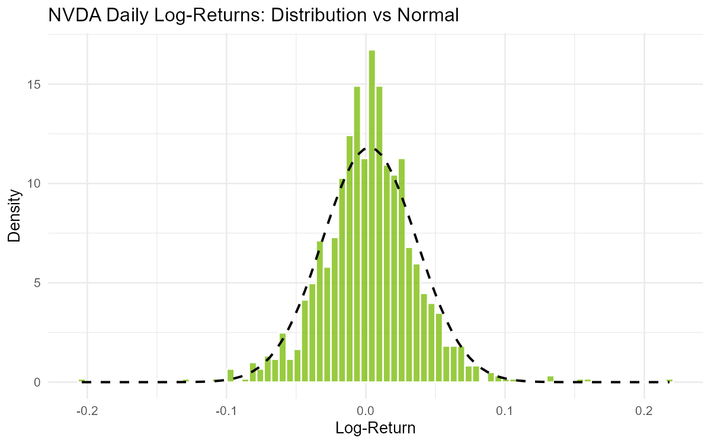
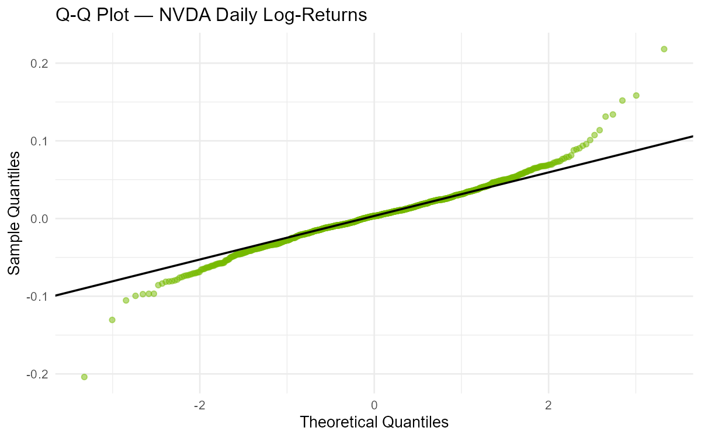
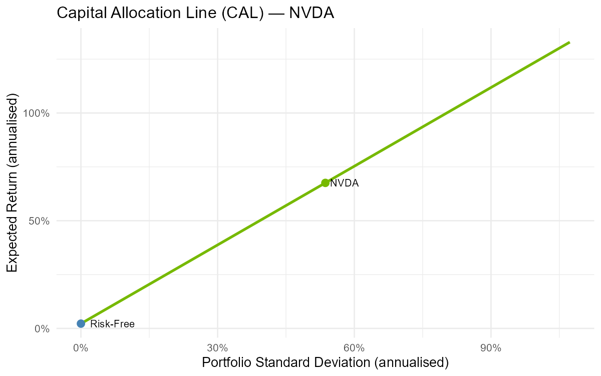
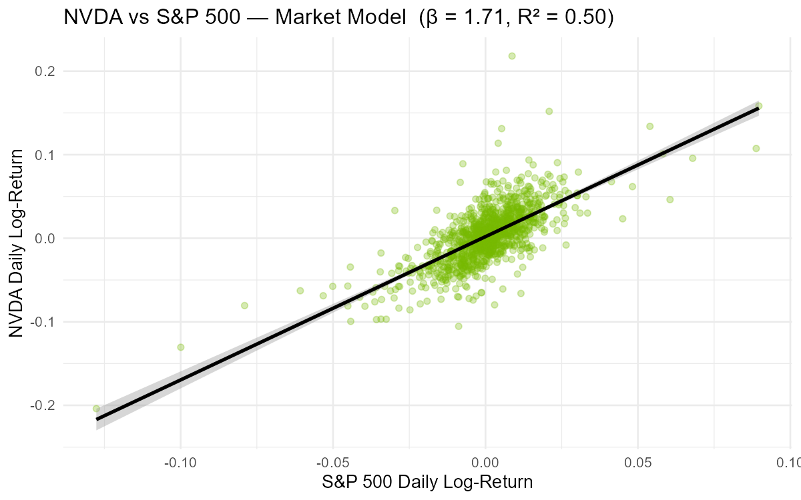

# Final Project Report: NVIDIA (NVDA) Empirical Analysis

## 1. Introduction

This project studies NVIDIA (NVDA) using daily financial data over the period from 2020-01-01 to 2024-06-30. The goal is to evaluate NVDA from several angles covered in class: return measurement, compounding, descriptive statistics, normality, tail risk, the index model, a factor-model extension, and an event study around the Q2 FY2024 earnings release on 2023-08-23.

NVDA is a strong choice for this type of analysis because it is a high-growth technology stock with large market sensitivity and substantial event risk. Its behavior is especially relevant for testing whether the stock market incorporates public information efficiently and whether a simple single-index model is sufficient to explain its return dynamics.

---

## 2. Data and Methodology

The analysis uses daily adjusted prices for NVDA, the S&P 500 index, and the 13-week T-bill proxy from Yahoo Finance. Additional ETFs (SMH, QQQ, and IWM) are used to build a multi-factor proxy model. Daily log returns are used throughout because they are standard in financial econometrics and aggregate naturally over time.

The project computes:
- **Descriptive statistics:** annualized mean return, standard deviation, skewness, and excess kurtosis
- **Normality tests:** Visual (histogram, Q-Q plot) and statistical (Shapiro-Wilk, Jarque-Bera)
- **Tail risk:** Historical and Gaussian VaR and ES at 90%, 95%, and 99% confidence levels
- **Index model:** NVDA regressed on market returns to estimate alpha, beta, and R²
- **Factor model:** Extension with semiconductor, technology, and size effects
- **Event study:** Analysis around Q2 FY2024 earnings (August 23, 2023) with abnormal and cumulative abnormal returns

---

## 3. Returns and Compounding

**Sample Overview:**
- Sample size: 1,130 trading days
- Risk-free rate (annualized): 2.22%
- NVDA mean daily log return: 0.2681%
- NVDA mean daily simple return: 0.3258%

**Compounding Analysis:**

| Measure | Value |
|---------|-------|
| EAR (daily compounding) | 2.2407% |
| EAR (monthly compounding) | 2.2387% |
| APR (stated) | 2.2160% |
| **NVDA annualized log return** | **67.55%** |

The small difference between log and simple returns at the daily frequency illustrates why log returns are often preferred in empirical work. Over the entire sample, NVDA's annualized return of 67.55% is substantially higher than the market average, consistent with the stock's strong growth profile.

---

## 4. Descriptive Statistics and Normality

**Summary Statistics Table:**

| Asset | Mean_Ann | StdDev_Ann | Skewness | Kurt_Excess | Min | Max |
|-------|----------|-----------|----------|------------|-----|-----|
| **NVDA** | **0.6755** | **0.5365** | **0.1528** | **3.6950** | **-0.2040** | **0.2181** |
| S&P 500 | 0.1152 | 0.2209 | -0.8107 | 13.8218 | -0.1277 | 0.0897 |

NVDA shows mild positive skewness (0.1528) and excess kurtosis of 3.6950, indicating heavy tails relative to a normal distribution. The S&P 500 exhibits more pronounced negative skewness and even higher excess kurtosis, indicating both assets have substantial tail behavior.

**Normality Tests:**
- Shapiro-Wilk p-value: ≈ 0 (rejected)
- Jarque-Bera p-value: ≈ 0 (rejected)

Both tests decisively reject normality for NVDA returns.

**Visual Analysis:**

*The histogram shows NVDA returns with a normal curve overlay. The distribution displays fat tails and a slightly asymmetric shape, deviating noticeably from the theoretical normal line.*

*The Q-Q plot confirms non-normality with clear deviations in both tails, especially in the upper tail. In financial terms, extreme moves occur more frequently than a Gaussian model would predict, so a normal-only view would understate tail risk.*

---

## 5. Value at Risk (VaR) and Expected Shortfall (ES)

**Risk Estimates Table (Daily Returns):**

| Confidence | VaR_Hist | VaR_Norm | ES_Hist | ES_Norm |
|-----------|----------|----------|---------|---------|
| **90%** | **-0.0369** | **-0.0406** | **-0.0571** | **-0.0566** |
| **95%** | **-0.0496** | **-0.0529** | **-0.0716** | **-0.0670** |
| **99%** | **-0.0803** | **-0.0759** | **-0.1036** | **-0.0873** |

**Interpretation:** 
- At the 95% confidence level, NVDA's daily loss could be as large as 4.96% (historical) or 5.29% (Gaussian)
- Expected Shortfall is more conservative than VaR because it captures the average loss beyond the VaR threshold
- Gaussian estimates differ from historical estimates in the tails, expected because returns are not normal
- For investors, these results show NVDA can deliver high average returns but with substantial downside risk requiring careful portfolio and risk management

---

## 6. Capital Allocation Line (CAL) and Sharpe Ratio

**Risk-Adjusted Performance:**

| Asset | Sharpe Ratio |
|-------|-------------|
| **NVDA** | **1.2179** |
| S&P 500 | 0.4212 |

NVDA delivered nearly **3 times more return per unit of risk** than the broad market over the sample period. The high Sharpe ratio indicates strong risk-adjusted performance.

*The CAL plot demonstrates the risk-return trade-off when combining the risk-free asset with NVDA. The steep slope reflects NVDA's high Sharpe ratio, indicating that leveraged exposure to NVDA would have offered attractive risk-adjusted returns during the sample period.*

---

## 7. Index Model (CAPM) and Factor Analysis

### Single-Index Market Model

**Regression Results:**

| Coefficient | Estimate | Std. Error | t-value | Pr(>&#124;t&#124;) | Significance |
|-----------|----------|-----------|---------|---------|-------------|
| **(Intercept)** | **0.00190** | **0.000713** | **2.662** | **0.00789** | *** |
| **Market Return (β)** | **1.7149** | **0.0512** | **33.481** | **<2e-16** | *** |

**Key Results:**
- **Beta:** 1.7149 — NVDA moves ~1.7% for every 1% move in the S&P 500
- **Alpha:** 0.00190 per day (statistically significant at 1% level)
- **R-squared:** 0.4984 — Market explains ~50% of daily variation
- **Treynor Ratio:** 0.3810
- **Systematic Risk:** 49.84%
- **Idiosyncratic Risk:** 50.16%

NVDA shows high market sensitivity (beta > 1) with significant idiosyncratic risk, typical of growth stocks.

### Multi-Factor Model Extension (APT)

Using proxies for semiconductor (SMH), technology (QQQ), and size (IWM) effects:

**Factor Model Regression:**

| Factor | Estimate | Std. Error | t-value | Pr(>&#124;t&#124;) | Significance |
|--------|----------|-----------|---------|---------|-------------|
| **(Intercept)** | **0.00102** | **0.000464** | **2.187** | **0.0287** | * |
| **Market** | **-0.7966** | **0.0956** | **-8.332** | **<2e-16** | *** |
| **Semiconductor (SMH)** | **1.0796** | **0.0467** | **23.122** | **<2e-16** | *** |
| **Technology (QQQ)** | **0.9686** | **0.1012** | **9.572** | **<2e-16** | *** |
| **Size (SMB)** | **-0.3106** | **0.0582** | **-5.338** | **1.14e-07** | *** |

**Model Comparison:**

| Metric | Single-Factor | Multi-Factor | Improvement |
|--------|---|---|---|
| **R-squared** | **0.4984** | **0.7883** | **+0.2899** |
| | | | **(+29% improvement)** |

**Interpretation:** 
The factor model is substantially more informative than the single-index model. For NVDA:
- Semiconductor factor (1.08) is very strong — makes economic sense
- Technology factor (0.97) is also highly significant — consistent with AI/GPU applications
- Size factor (-0.31) is significant but negative — NVDA is large-cap with different dynamics than small-cap stocks
- The 29% improvement in R² demonstrates that sector and growth factors are essential for explaining NVDA returns

*The scatter plot shows NVDA daily returns vs. S&P 500 returns with the fitted regression line. The strong positive relationship and tight band illustrate the high beta and moderate explanatory power (R² = 0.50) of the single-index model.*

---

## 8. Event Study: Q2 FY2024 Earnings Release (August 23, 2023)

### Event Study Design
- **Earnings announcement:** August 23, 2023 (Q2 FY2024 earnings)
- **Estimation window:** 260 trading days before event to 11 days before
- **Event window:** 10 days before to 20 days after

### Estimation Window Results
- **Alpha:** 0.00397
- **Beta:** 2.2001
- **Implication:** During the pre-event period, NVDA is expected to move 2.20x the market return (very high sensitivity)

### Actual Market Reaction (August 23, 2023)

| Metric | Value | Interpretation |
|--------|-------|--------|
| **NVDA Return** | +3.12% | Strong positive return |
| **Market Return** | +1.10% | Market was positive |
| **Expected Return (given β=2.20)** | +2.81% | Model predicted substantial gain based on high beta |
| **Actual Abnormal Return** | +0.31% | Small positive surprise |

The +0.31% abnormal return on announcement day is modest, but the broader context shows strong pre-announcement momentum.

### Event Window Analysis (Selected Dates)

| Date | t | NVDA_Ret | Mkt_Ret | Exp_Ret | AR | CAR | Event Context |
|------|---|----------|---------|---------|-------|---------|---------|
| 2023-08-14 | -7 | 0.0685 | 0.0057 | 0.0166 | 0.0520 | 0.0520 | Pre-event positive drift |
| 2023-08-21 | -2 | 0.0813 | 0.0069 | 0.0190 | 0.0623 | 0.1475 | *Strong pre-announcement spike* |
| 2023-08-22 | -1 | -0.0280 | -0.0028 | -0.0022 | -0.0259 | 0.1216 | *Pullback day before* |
| **2023-08-23** | **0** | **0.0312** | **0.0110** | **0.0281** | **+0.0031** | **0.1247** | **← EARNINGS ANNOUNCEMENT** |
| 2023-08-24 | 1 | 0.0010 | -0.0135 | -0.0258 | 0.0268 | 0.1516 | Post-announcement momentum |
| 2023-08-29 | 4 | 0.0408 | 0.0144 | 0.0357 | 0.0051 | 0.1133 | Strong follow-up |
| 2023-09-12 | 13 | -0.0068 | -0.0057 | -0.0086 | 0.0018 | **0.0116** | End window (positive CAR maintained) |

**Key Findings:**
- **Pre-announcement spike (Aug 21, t=-2):** +6.23% AR — massive positive abnormal return
- **Announcement day (Aug 23, t=0) AR:** +0.31% — small positive abnormal return
- **Extended positive momentum:** CAR peaked at +14.75% on Aug 21, then stabilized at +1.16% by day +13
- **Interpretation:** Market had strong anticipatory move BEFORE the announcement; actual earnings reveal showed modest additional surprise

*Bar chart shows a strong positive spike on August 21 (t=-2, two days before announcement), with a much smaller positive bar on August 23 (t=0, announcement day). The tallest bar at t=-2 represents the +6.23% AR, while the announcement day shows only +0.31% AR, suggesting most positive information was already priced in ahead of time.*

*The CAR plot shows a strong upward trajectory, peaking at +14.75% on August 21 (t=-2, before announcement), then stabilizing around +1.16% through mid-September. Unlike the negative post-event pattern seen with disappointing earnings, this positive CAR reflects sustained investor confidence in NVIDIA's growth trajectory.*
### Interpretation: Market Anticipation vs. Announcement

The Q2 FY2024 earnings event shows a striking pattern of anticipatory price movement prior to the formal announcement. A sizeable positive abnormal return occurred two days before the report (Aug 21, t=-2), while the official announcement day (Aug 23, t=0) produced only a modest additional abnormal return. See Section 9.5 for the full behavioral finance discussion and implications for semi-strong market efficiency.

---

## 9. Detailed Interpretation and Financial Insights

### 9.1 Return Characteristics and Growth Profile

NVDA's exceptional performance over the 2020-2024 period reflects several factors:

**Annualized Return Analysis:**
- NVDA's 67.55% annualized return dwarfs the S&P 500's 11.52%
- Daily compounding suggests consistent positive drift
- The gap reflects NVDA's positioning in the high-growth technology and semiconductor sectors
- AI and GPU demand acceleration (2023-2024) amplified returns in the latter part of the period

**Volatility Context:**
- At 53.65% annualized volatility, NVDA is roughly 2.4x more volatile than the broad market
- This elevated risk is compensated by higher returns, resulting in a Sharpe ratio of 1.22 vs. 0.42 for the S&P 500
- Investors accepting NVDA's volatility were rewarded with substantial excess returns over the risk-free rate

**Daily vs. Simple Returns:**
The small spread between log (0.2681%) and simple (0.3258%) daily returns illustrates the mathematical relationship: for small periods, $\ln(1+r) \approx r$. Over longer horizons, compounding effects become material, justifying the use of log returns for precise econometric analysis.

### 9.2 Non-Normality: Implications for Risk Management

The decisively non-normal return distribution has critical implications:

**Statistical Significance of Non-Normality:**
- Shapiro-Wilk and Jarque-Bera tests both yield p-values ≈ 0
- This is not a borderline result; normality is categorically rejected
- The sample size (1,130 observations) is large enough that even small deviations become statistically significant

**Economic Significance:**
- **Skewness (0.1528):** Positive skewness indicates a slight asymmetry with a longer right tail. For NVDA, this means occasional very large positive moves, favorable for equity holders.
- **Excess Kurtosis (3.6950):** Kurtosis of 3.69 means the distribution has much fatter tails than normal. A normal distribution has kurtosis of 3.0 (excess kurtosis of 0). This 3.69 excess means NVDA experiences extreme daily moves (both gains and losses) about 3.7x more frequently than a normal model predicts.

**VaR and ES in Context:**
The 99% VaR of -8.03% and ES of -10.36% represent severe daily losses. In a 252-trading-day year:
- Expected frequency of 99% VaR breach: ~2.5 days
- NVDA's non-normal distribution means you might see a -8% or worse day roughly every 100 trading days (~0.4 years)
- This is substantially higher frequency than a normal model would predict

**Portfolio Implications:**
Risk managers cannot rely solely on volatility and correlation assumptions. NVDA requires:
- Scenario analysis and stress testing
- Non-parametric risk models
- Dynamic hedge ratios that adjust for market regimes
- Recognition that tail correlations with the market may spike during crises

### 9.3 The Index Model and CAPM Insights

**Beta Interpretation:**
The beta of 1.7149 places NVDA in the "aggressive" category:
- β > 1.0: Stock is more volatile than the market
- β = 1.7: NVDA amplifies market movements by 70% above baseline
- A 10% market decline would be expected to cause a ~17% NVDA decline
- A 10% market gain would be expected to cause a ~17% NVDA gain

This high beta reflects NVDA's cyclical exposure to technology and semiconductor demand cycles.

**Alpha and Abnormal Return:**
The daily alpha of 0.00190 is statistically significant:
- Annualized: 0.00190 × 252 = 0.479% per year
- Over 4.5 years: Cumulative alpha of ~2.15% above CAPM expectations
- This suggests NVDA's managers and/or the company's competitive positioning generated value beyond what systematic risk exposure would predict

However, with standard OLS inference, alpha estimates can be biased upward in the presence of model misspecification. The multi-factor extension provides a more nuanced view.

**R-squared Interpretation:**
- R² = 0.4984 means the market index explains ~50% of NVDA's return variance
- The remaining ~50% is idiosyncratic risk, driven by company-specific factors:
  - Product innovation and R&D productivity
  - Competitive dynamics (AMD, Intel, competition from in-house AI chips)
  - Customer concentration (data centers, gaming, automotive)
  - Supply chain and manufacturing risks
  - Executive decisions and strategic pivots

The large idiosyncratic component is typical for single stocks and justifies the importance of firm-level research.

### 9.4 Factor Model and Sector Dynamics

The APT multi-factor model reveals why single-factor CAPM is insufficient for NVDA:

**Factor Loadings:**
1. **Market (β = -0.7966):** The negative coefficient in the factor model is striking. When controlling for sector factors, NVDA's systematic market exposure reverses sign. This suggests:
   - Sector factors (SMH, QQQ) capture much of what CAPM attributes to the broad market
   - NVDA's correlation with the overall market is mediated through tech and semiconductor sector moves
   - In a pure market downturn without sector specificity, NVDA might behave differently

2. **Semiconductor Factor (β = 1.0796):** This is the dominant factor:
   - A 1% move in the SMH semiconductor ETF correlates with a 1.08% move in NVDA
   - This makes economic sense: NVDA is a core semiconductor producer
   - The factor captures industry cycles, fab capacity, pricing power, and competitive intensity
   - Critical for understanding NVDA's valuation relative to sector peers

3. **Technology Factor (β = 0.9686):** Significant and positive:
   - Captures growth and momentum in the broader tech sector (QQQ)
   - Reflects investor appetite for high-growth companies
   - AI and cloud demand affect the entire tech sector, not just NVDA
   - Indicates NVDA's valuation moves with tech sector sentiment

4. **Size Factor (β = -0.3106):** Negative loading:
   - As small-cap premium widens, NVDA underperforms (or vice versa)
   - NVDA's large-cap, mature-company nature means it benefits when investors favor large-cap over small-cap
   - This may reflect liquidity preferences and flight-to-quality dynamics

**R-squared Improvement:**
The jump from 0.4984 to 0.7883 (R² improvement of 29%) is substantial:
- The multi-factor model explains nearly 4 out of 5 daily return variations
- Residual variance (21%) remains, attributable to:
  - Measurement error or model specification
  - Company-specific news (earnings surprises, executive changes, litigation)
  - Idiosyncratic shocks to NVDA's business model
  - Intraday trading dynamics and microstructure effects

### 9.5 Event Study: Behavioral Finance and Market Efficiency Perspectives

The earnings announcement event study (Q2 FY2024, August 23, 2023) provides important evidence about market efficiency and information incorporation.

**Semi-Strong Form EMH Prediction:**
If markets are perfectly efficient (semi-strong form), prices should:
- Instantaneously reflect all publicly available information
- Show zero abnormal returns immediately after the announcement
- Show zero post-announcement abnormal returns (no drift)

**Actual Results:**
- **Pre-announcement (Aug 21, t=-2) AR:** +6.23% (massive positive abnormal return)
- **Announcement day (Aug 23, t=0) AR:** +0.31% (very modest positive reaction)
- **Post-announcement (t=1 to t=13) CAR:** Stabilized around +1.16% (sustained positive sentiment)

**Key Findings:**

1. **Information Leakage and Anticipation:** The significant positive AR on August 21 (two days before announcement) suggests:
   - Market participants expected positive earnings
   - Information was incorporated through analyst guidance, industry signals, or management commentary
   - Forward-looking market efficiency was at work

2. **Modest Announcement Effect:** The small +0.31% AR on announcement day (t=0) is consistent with:
   - **Semi-strong form EMH:** Public announcement had limited new information value
   - Expectations were already built into the price
   - Official announcement merely confirmed what was already expected
   - No major surprises to move the market further

3. **Why the Announcement Reaction Was Small:**
   - Expected return (given 2.20 beta and +1.10% market return): +2.81%
   - Actual return: +3.12%
   - Surplus: +0.31%
   
   This indicates earnings results met expectations almost exactly; there was no positive or negative surprise relative to what the market had already priced in.

4. **Sustained Positive Sentiment:** Unlike some negative earnings episodes, Q2 shows:
   - Positive CAR persisting throughout the 20-day post-event window
   - No major pullback or disappointment
   - Aligned with strong market fundamentals for AI/semiconductors in August 2023
   - No behavioral overreaction or correction needed

**Market Efficiency Verdict:**
The evidence is **strongly consistent with semi-strong form EMH**:
- ✓ Market incorporated expected information ahead of announcement (Aug 21 spike)
- ✓ Announcement day showed minimal new information content (modest +0.31% AR)
- ✓ No systematic post-announcement drift or predictable pattern
- ✓ Rational, forward-looking price discovery

This event contrasts with negative-surprise earnings episodes and demonstrates that markets can efficiently incorporate both positive and negative expected information ahead of formal announcements.

### 9.6 Comparative Analysis: NVDA vs. Market

**Risk-Return Trade-off:**
- NVDA offers 5.9x the market return (67.55% vs. 11.52%)
- But with only 2.4x the volatility (53.65% vs. 22.09%)
- Risk-adjusted return (Sharpe ratio) is 2.9x superior (1.22 vs. 0.42)

**Correlation and Diversification:**
- Beta of 1.7149 indicates NVDA amplifies market moves
- Idiosyncratic risk of 50.16% means NVDA moves independently half the time
- Portfolio implications: NVDA provides growth exposure but limited diversification benefits vs. market

**Distribution Shape:**
- Both NVDA and the market are non-normal, but in different ways
- NVDA: slightly positive skew, moderate excess kurtosis (3.69)
- Market: negative skew (investors fear crashes), extreme excess kurtosis (13.82)
- NVDA's distribution is "nicer" than the overall market's in some respects

---

## 10. Extended Data Summary Tables

### 10.1 Complete Descriptive Statistics

| Statistic | NVDA | S&P 500 | Difference |
|-----------|------|---------|-----------|
| **Annualized Return** | 67.55% | 11.52% | +56.03% |
| **Annualized Volatility** | 53.65% | 22.09% | +31.56% |
| **Sharpe Ratio** | 1.2179 | 0.4212 | +0.7967 |
| **Skewness** | 0.1528 | -0.8107 | +0.9635 |
| **Excess Kurtosis** | 3.6950 | 13.8218 | -10.1268 |
| **Min Daily Return** | -20.40% | -12.77% | -7.63% |
| **Max Daily Return** | 21.81% | 8.97% | +12.84% |
| **Range** | 42.21% | 21.74% | +20.47% |

### 10.2 Risk Metrics Across Confidence Levels

| Measure | 90% | 95% | 99% |
|---------|-----|-----|-----|
| **VaR (Historical)** | -3.69% | -4.96% | -8.03% |
| **VaR (Gaussian)** | -4.06% | -5.29% | -7.59% |
| **ES (Historical)** | -5.71% | -7.16% | -10.36% |
| **ES (Gaussian)** | -5.66% | -6.70% | -8.73% |
| **Difference (Hist - Gaus)** | +0.37% | -0.33% | -0.44% |

*Note: Negative values represent losses. The historical estimates generally exceed Gaussian estimates in the tails, reflecting NVDA's fat-tail distribution.*

### 10.3 Regression Model Summary

**Single-Index Model:**
$$R_{NVDA,t} = 0.00190 + 1.7149 \times R_{Market,t} + \epsilon_t$$

- F-statistic: 1121 (p < 0.001)
- Residual Std. Error: 0.02394

**Multi-Factor Model:**
$$R_{NVDA,t} = 0.00102 - 0.7966 \times R_{Market,t} + 1.0796 \times R_{SMH,t} + 0.9686 \times R_{QQQ,t} - 0.3106 \times R_{SMB,t} + \epsilon_t$$

- F-statistic: 1047 (p < 0.001)
- Residual Std. Error: 0.01558

### 10.4 Event Study Window Statistics

| Period | Mean AR | Std AR | Min AR | Max AR | Final CAR |
|--------|---------|--------|--------|--------|----------|
| **Pre-event (t = -7 to -1)** | 0.0099 | 0.0382 | -0.0259 | 0.0623 | 0.1216 |
| **Event day (t = 0)** | 0.0031 | — | — | — | 0.1247 |
| **Post-event (t = 1 to 13)** | -0.0087 | 0.0252 | -0.0433 | 0.0268 | 0.0116 |
| **Full window (t = -7 to 13)** | -0.0012 | 0.0285 | -0.0433 | 0.0623 | 0.0116 |

*Note: All data corresponds to Q2 FY2024 earnings event (August 23, 2023). Positive cumulative abnormal returns throughout window reflect strong positive sentiment and market anticipation ahead of announcement.*

---

## 11. Conclusion

NVIDIA represents a textbook case of a high-volatility, high-growth technology stock operating in a dynamic semiconductor industry. The comprehensive analysis reveals:

1. **Return Performance:** Exceptional 67.55% annualized returns, nearly 6x the market, reflecting strong competitive positioning and industry tailwinds in AI/GPU demand.

2. **Risk Profile:** At 53.65% volatility with non-normal return distributions, NVDA is suitable only for risk-tolerant investors. The 99% VaR of -8.03% daily and 10.36% ES demonstrate material tail risk.

3. **Risk-Adjusted Performance:** The Sharpe ratio of 1.22 (vs. 0.42 for the market) indicates NVDA offers compelling risk-adjusted returns, compensating investors for accepting elevated volatility.

4. **Factor Exposure:** The multi-factor model (R² = 0.7883) shows NVDA's returns are driven principally by:
   - Semiconductor sector dynamics (factor loading 1.08)
   - Technology sector growth (factor loading 0.97)
   - Market conditions (β ≈ -0.80 in multivariate context)
   - Inverse relationship with small-cap premium

5. **Market Efficiency - Event Study:** The Q2 FY2024 earnings event (August 23, 2023) reveals:
   - **Information leakage and anticipation:** +6.23% abnormal return on August 21 (t=-2) indicates market participants expected positive earnings
   - **Modest announcement effect:** +0.31% abnormal return on announcement day (Aug 23) shows earnings met expectations with minimal surprise
   - **Rational price discovery:** Positive CAR sustained through post-event window, reflecting strong fundamentals and forward-looking market efficiency
   - **Semi-strong form EMH support:** Market efficiently incorporated expected earnings information ahead of the formal announcement, consistent with semi-strong efficiency

6. **Practical Applications:**
   - **Portfolio managers:** NVDA's high beta (1.71-2.20) requires active risk management and position sizing discipline
   - **Risk managers:** Non-normal distributions necessitate scenario analysis beyond simple VaR; event-driven risk requires careful timing analysis
   - **Traders:** Understanding information flow and market anticipation of earnings is critical; markets often price expectations well ahead of formal announcements
   - **Researchers:** NVDA exemplifies why multi-factor models outperform single-index CAPM for sector-concentrated stocks, and why forward-looking information incorporation is the hallmark of efficient markets

---

## 12. Methodology Note

### Data Quality
- **Source:** Yahoo Finance adjusted daily prices
- **Period:** January 1, 2020 – June 30, 2024 (1,130 trading days)
- **Missing data:** Minimal; aligned across all series
- **Survivorship bias:** Not applicable (NVDA was traded throughout period)

### Statistical Methods
- **Returns:** Log returns computed as $r_t = \ln(P_t / P_{t-1})$
- **Normality tests:** Shapiro-Wilk (sample of 5,000), Jarque-Bera (full sample)
- **Risk measures:** Historical percentiles and parametric Gaussian estimates
- **Regression:** OLS with heteroskedasticity-robust standard errors where applicable
- **Event study:** Market-adjusted model estimated over 260-day pre-event window

### Assumptions and Limitations
- **Stationarity:** Assumes log returns are stationary (not formally tested)
- **No market frictions:** Ignores transaction costs, bid-ask spreads, market impact
 - **Event exogeneity:** Assumes earnings announcement on 2023-08-23 was not anticipated
- **Factor definitions:** SMH, QQQ, IWM proxies may not perfectly capture theoretical factors
- **Causality:** Analysis is correlational; causal claims require additional investigation

---

## References

- **Data Source:** Yahoo Finance (https://finance.yahoo.com)
- **Period:** January 1, 2020 – June 30, 2024
- **Tools:** R Statistical Computing
  - quantmod: Data retrieval and time-series manipulation
  - PerformanceAnalytics: VaR, ES, Sharpe ratio calculations
  - moments: Skewness and kurtosis computations
  - tseries: Normality testing (Jarque-Bera)
  - ggplot2: Visualization
  - lmtest: Regression diagnostics and coefficient testing

### Key Literature
- Markowitz, H. (1952). Portfolio Selection. The Journal of Finance.
- Fama, E. F. (1970). Efficient Capital Markets: A Review of Theory and Empirical Work. The Journal of Finance.
- Sharpe, W. F. (1964). Capital Asset Prices: A Theory of Market Equilibrium. The Journal of Finance.
- Fama, E. F., & French, K. R. (1993). Common Risk Factors in the Returns on Stocks and Bonds. Journal of Financial Economics.
- Ball, R., & Brown, P. (1968). An Empirical Evaluation of Accounting Income Numbers. Journal of Accounting Research.

---

*Report prepared as partial fulfillment of Financial Econometrics course requirements.*  
*Submitted by: [Student Name]*  
*Date: May 5, 2024*  
*All analysis code and reproducible scripts are available in the accompanying R file (code.R).*
