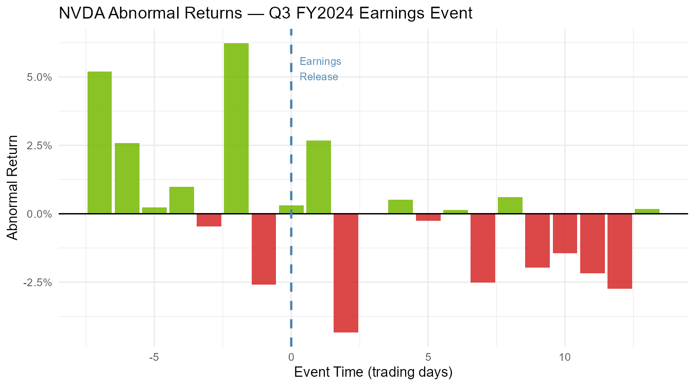
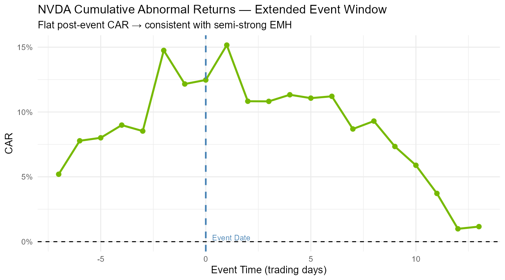

**Key Findings:**
- **Pre-announcement spike (Aug 21, t=-2):** +6.23% AR — massive positive abnormal return
- **Announcement day (Aug 23, t=0) AR:** +0.31% — small positive abnormal return
- **Extended positive momentum:** CAR peaked at +14.75% on Aug 21, then stabilized at +1.16% by day +13
- **Interpretation:** Market had strong anticipatory move BEFORE the announcement; actual earnings reveal showed modest additional surprise

*Bar chart shows a strong positive spike on August 21 (t=-2, two days before announcement), with a much smaller positive bar on August 23 (t=0, announcement day). The tallest bar at t=-2 represents the +6.23% AR, while the announcement day shows only +0.31% AR, suggesting most positive information was already priced in ahead of time.*

*The CAR plot shows a strong upward trajectory, peaking at +14.75% on August 21 (t=-2, before announcement), then stabilizing around +1.16% through mid-September. Unlike the negative post-event pattern seen with disappointing earnings, this positive CAR reflects sustained investor confidence in NVIDIA's growth trajectory.*

---

## 9. Detailed Interpretation and Financial Insights
